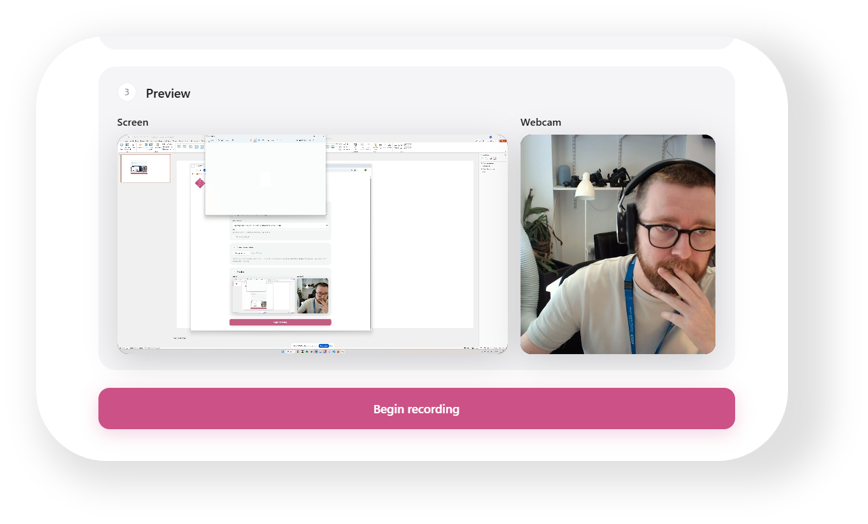

# Presenter
<p align="center">
	
</p>
A single-file browser recorder: capture your screen with your webcam in a circle in the
bottom-left corner, plus your voice. No server, no upload — the composite is built on a
`<canvas>` in your tab and the finished file downloads straight to your machine.

Styled to match [WebAV](https://github.com/Gareth-Power/WebAV) — same light Apple-ish
palette (`#2563eb` accent, `#1d1d1f`/`#86868b` text, `#f5f5f7` panels), same 22px panel
radius, ghost buttons, monospace pills, and the SaIL logo pinned top-left.

## Running it

The browser only exposes screen and camera capture in a *secure context*, so serve it over
`localhost` rather than double-clicking the file:

```powershell
# any one of these, from this folder
python -m http.server 8000
npx serve .
```

Then open <http://localhost:8000>.

Deploying it anywhere with HTTPS (GitHub Pages, Netlify, Vercel) works the same way —
`index.html` has no build step and no dependencies.

## How it works

| Step | API |
| --- | --- |
| List cameras/mics | `enumerateDevices()` after a throwaway `getUserMedia` grant (labels are hidden until permission is given) |
| Pick a screen | `getDisplayMedia()` — the browser's own picker, triggered by the button click |
| Composite | A `<canvas>` sized to the capture resolution: screen letterboxed, webcam centre-cropped into a clipped circle |
| Audio | Mic and system audio mixed through a `AudioContext` into one track |
| Encode | `canvas.captureStream(30)` + the mixed audio → `MediaRecorder` |
| Trim | [Mediabunny](https://mediabunny.dev) repackages the samples between the in/out points — no re-encode |
| Save | The trimmed `Blob` downloaded via an object URL |

## Trimming

Stopping a recording lands on a trim page rather than downloading straight away. Drag the
two handles to set the in and out points, preview the selection, then **Save clip**.

Two details make this work:

- **`video.duration` is `Infinity`.** `MediaRecorder` writes WebM with no duration in the
  header, so the video element can't tell you how long the recording is and the scrubber
  would have nothing to scale against. Mediabunny's `computeDuration()` reads the real
  length off the container.
- **The cut is a repackage, not a re-encode.** Trimming 2s out of a 6s clip measured at
  **72ms** in testing. Length is independent of clip length, and there's no quality loss.

Mediabunny (~613KB minified, ~157KB gzipped) is loaded with a dynamic `import()` that only
fires once recording *starts*, so the entry page stays instant and the library is usually
in memory by the time you press stop. If it fails to load, the page falls back to offering
the untrimmed recording.

Because the cut is lossless it can only land on a keyframe, so the start may snap by up to
a second or so — invisible for topping and tailing, not frame-exact. In testing a 2.000s
request produced a 1.972s file.

Output is always WebM. If you ever need MP4 for PowerPoint or iMovie, either convert
with `ffmpeg -i in.webm -c:v libx264 -c:a aac out.mp4`, or add it back in the app —
mediabunny can do it in-browser, and the one thing to know is that it must be asked
explicitly for `video: { codec: 'avc' }` and `audio: { codec: 'aac' }`. Left to itself it
copies VP9/Opus into an MP4 container, which is legal and which PowerPoint refuses to
open.

The draw loop is driven by `requestVideoFrameCallback` on the webcam element rather than
`requestAnimationFrame`, because rAF is throttled to a crawl once you switch away from the
tab — which is exactly what happens during a real recording.

## Things worth knowing

- **The screen source can't be a dropdown.** Browsers require their own picker, shown in
  response to a user gesture, so the entry page has a "Choose screen…" button instead.
- **System audio is opt-in and platform-limited.** You have to tick *Share audio* in the
  picker. Chrome/Edge support it for tabs and (on Windows) whole screens; Firefox and macOS
  are patchier. Mic audio always works.
- **Output is `.webm` (VP9/Opus)** — that's what `MediaRecorder` supports nearly
  everywhere. It plays in any browser and in VLC; for PowerPoint or iMovie, remux it:
  `ffmpeg -i in.webm -c:v libx264 -c:a aac out.mp4`.
- **Files are named `presenter-dd-mm-yyyy-hhmm`** in the machine's own timezone.
- **Firefox has no `requestVideoFrameCallback`**, so it falls back to a timer. Recording
  works, but keep the tab visible for the smoothest result.
- Clicking the browser's own *Stop sharing* bar ends the recording cleanly and still saves
  the file.

## Third-party code

Third-party license notices are collected in [THIRD_PARTY_LICENSES](THIRD_PARTY_LICENSES).

`mediabunny.min.js` is [Mediabunny](https://github.com/Vanilagy/mediabunny) v1.51.0,
MPL-2.0, vendored rather than pulled from a CDN so the app keeps working on a locked-down
network. See [THIRD_PARTY_LICENSES/Mediabunny-MPL-2.0.txt](THIRD_PARTY_LICENSES/Mediabunny-MPL-2.0.txt)
for attribution and license details.

## Branding

`SaIL.png` is taken from the WebAV repository, where it's the Simulation & Interactive
Learning team logo, copyright Guy's & St Thomas' NHS Foundation Trust. WebAV is licensed
AGPL-3.0-or-later — worth checking that this repo's licensing lines up before it goes
anywhere public.

## Tweaking the bubble

Top of the `<script>` block in [index.html](index.html):

```js
const BUBBLE_HEIGHT_RATIO = 0.24;   // circle diameter as a fraction of video height
const BUBBLE_MARGIN_RATIO = 0.035;  // gap from the bottom-left corner
const FPS = 30;
```

To move the bubble to another corner, change `cx` / `cy` in the draw loop.
